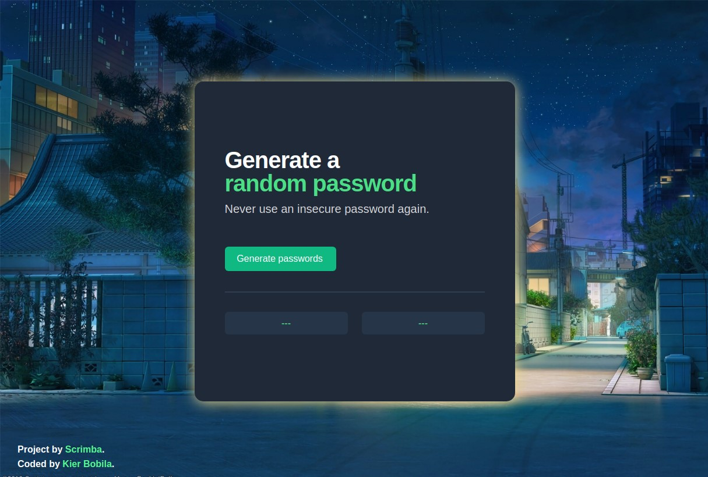
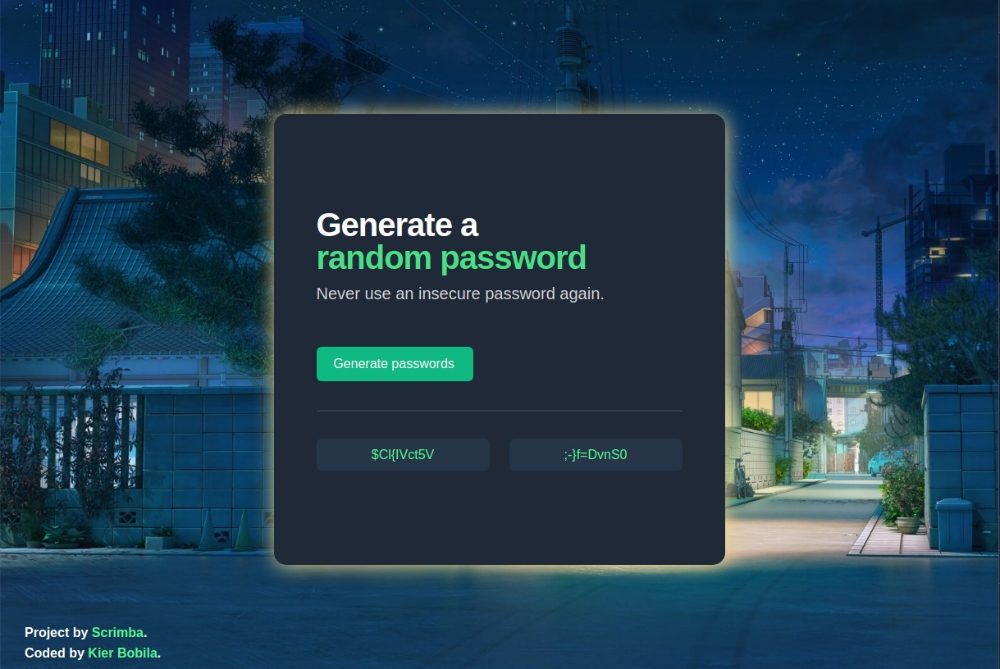

# Random Password Generator
A random password generator, the second personal project under [Learn JavaScript at Scrimba](https://scrimba.com/learn/learnjavascript).

## Table of contents
- [Introduction](#introduction)
- [Overview](#overview)
  - [Screenshot](#screenshot)
  - [Built using](#built-using)
  - [Lessons Applied](#lessons-applied)
- [Author](#author)
- [Acknowledgement](#acknowledgement)
## Introduction
- This is my solution to the second solo project of [Learn JavaScript](https://scrimba.com/learn/learnjavascript).
- This webpage is a simple password generator, with some functionalities such as:
    - Generating string with random characters

## Overview
- Link: [github.com/kierhb/password-generator](https://github.com/kierhb/password-generator)

### Screenshot

### Built using

- HTML5 markup
- CSS
- Vanilla JavaScript

### Lessons Applied:

- Generating random number for indexing
- Looping through the array of characters
- Concatenating strings
- Assigning functions to buttons

## Author

- GitHub - [@kierhb](https://github.com/kierhb)
- LinkedIn - [Kier Bobila](https://www.linkedin.com/in/kier-bobila/)

## Acknowledgement
I want to acknowledge one of the co-founders and CEO of [Scrimba](https://scrimba.com), the course instructor Per Harald Borgen and to all members of Scrimba community.
